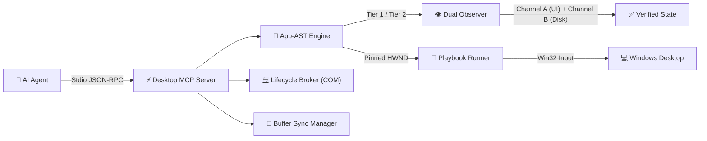

# ⚡ Desktop Control Harness

<p align="center">
  <strong>A Deterministic, State-Aware Automation Runtime for AI Computer-Use Agents on Windows</strong>
</p>

<p align="center">
  
  
  
  
  
  
</p>

<p align="center">
  <a href="#quickstart">Quickstart</a> •
  <a href="#the-paradigm-shift">Why Harness?</a> •
  <a href="#visual-proof-verified-eda-showcase">Visual Proof</a> •
  <a href="#core-innovations">Architecture</a> •
  <a href="#empirical-benchmark-summary">Benchmarks</a> •
  <a href="AGENTS.md">Agent Guide</a> •
  <a href="WALKTHROUGH.md">Case Studies</a>
</p>

---

## The Paradigm Shift

Most AI computer-use agents treat desktop automation as an open-loop sequence of full-screen captures and blind mouse clicks:

$$\text{Agent} \longrightarrow \text{Screenshot (~700 tokens)} \longrightarrow \text{Vision Reasoning} \longrightarrow \text{Blind Coordinate Click} \longrightarrow \dots$$

In native desktop engineering software (CAD, EDA, simulation tools, Office), this pattern quickly collapses:
- **Context Exhaustion**: Serializing full accessibility trees or screenshots consumes 3,000–5,000 tokens per turn, exhausting agent context in 10–15 steps.
- **Coordinate & DPI Drift**: Per-Monitor DPI scaling (125%, 150%) causes drift between screenshot pixels and physical mouse events.
- **Canvas Blindness**: Custom-rendered surfaces (EDA schematics, waveform plots, DirectX viewports) lack accessibility nodes entirely.
- **The Stale Working Buffer Trap**: Modifying netlists or files on disk while document tabs are open in GUI memory causes silent out-of-sync executions (the application ignores on-disk changes).

**Desktop Control Harness** replaces blind clicking with **state-aware, verified transactions**:
*Observe State $\longrightarrow$ Assert Precondition $\longrightarrow$ Execute Atomic App-AST Recipe $\longrightarrow$ Dual-Channel Verification.*

| Dimension | Conventional Vision Agents | Desktop Control Harness 2.0 |
| :--- | :--- | :--- |
| **Perception Latency** | 1,500 – 3,000 ms (VLM API) | **< 35 ms** (Tier 1 Edge Win32/UIA) |
| **Per-Turn Tokens** | ~700 – 3,500 tokens | **~15 – 73 tokens** (90–99% reduction) |
| **Complex Workflow (15 Steps)** | 15 turns (~10,500 – 48,000 tokens) | **2 turns (~70 tokens)** via App-AST recipes |
| **Verification Loop** | None (open-loop hope) | **Dual-Channel** (UI state + file metrics regex) |
| **Display Robustness** | Prone to multi-monitor DPI drift | **Per-Monitor v2 DPI normalized** |
| **Safety Boundary** | Unrestricted coordinate clicks | **HWND-pinned transactions + process tree guards** |

---

## Visual Proof: Verified EDA Showcase

Autonomous closed-loop synthesis and verification of an analog CMOS Two-Stage Miller Operational Transconductance Amplifier (OTA) in **LTspice XVII**:

<p align="center">
  
</p>

> **What happens in this recording**:
> 1. **Lifecycle Broker**: Attaches to LTspice via Windows Shell COM broker on the user's interactive desktop (`winsta0\default`).
> 2. **Buffer Sync**: Inspects the active document, detects dirty on-disk revision, and cleanly discards the stale buffer (`Ctrl+W`).
> 3. **App-AST Recipe Execution**: Dispatches `open_schematic` $\to$ `run_simulation` $\to$ `plot_trace("V(vout)")` with HWND pinning and modal focus protection.
> 4. **Live Bode Plot**: Dynamically renders the analog frequency response with solid magnitude (dB) and dashed phase (degrees) curves across 10Hz–1GHz.
> 5. **Dual-Channel Verification**: Cross-verifies waveform viewer UI with SPICE solver log, extracting DC gain ($A_0 = 91.73\text{ dB}$) and Gain-Bandwidth Product ($GBW = 36.97\text{ MHz}$).

---

## Core Innovations



### ⚡ 1. Dual-Tier Hybrid Perception (<35ms Edge UIA + Visual Escalation)
- **Tier 1 (Win32 / UIA)**: Walks foreground accessibility trees in <35ms, filtering noisy nodes into compact `#ID` labels (~70 tokens).
- **Tier 2 (Lanczos Visual Fallback)**: Automatically escalates to 1280px screenshots when custom canvases (EDA/DirectX) report 0 accessibility controls.

### 🌳 2. Application State Tree (App-AST) & Verified Recipes
- Formalizes desktop applications as finite-state machines with deterministic transitions.
- Replaces 15 fragile pixel clicks with single atomic recipes:
  - `open_schematic(path=...)`: `Ctrl+W` tab discard $\to$ `Ctrl+O` $\to$ typed path $\to$ `Enter`.
  - `run_simulation()`: Clicks toolbar Run button $\to$ waits for waveform viewer.
- Cuts multi-step context consumption by **99.9%** (70 tokens vs 48,000 tokens).

### 🎯 3. Dual-Channel Verification (UI + Artifact Telemetry)
- **Channel A (UI State)**: Asserts postcondition UI state (e.g. `waveform_active`).
- **Channel B (Ground Truth Metrics)**: Automatically parses domain output artifacts (`.log`, `.raw`, `.csv`) via regex extractors to assert real engineering constraints.

### 🛡️ 4. Working Buffer Synchronization & Semantic Safety
- **BufferSyncManager**: Solves the native desktop "stale tab" problem by comparing disk sha256 against open window captions and invalidating buffers prior to reloads.
- **HWND Pinning & Focus Guard**: Binds recipes to target HWNDs and re-asserts focus if OS notifications cause focus drift.
- **Terminal Suicide Guard**: Traverses agent process trees to hard-block accidental closure of the host terminal.
- **Self-Healing Friction Ledger**: Persists operational quirks to `knowledge/friction_ledger.json` for automatic recovery.

---

## Empirical Benchmark Summary

Statistical evaluation ($N=25$) on Windows 11 Per-Monitor v2 DPI dual-display desktop:

| Metric | Baseline Vision | Baseline Raw UIA | Harness (Tier 1) | Harness (App-AST) |
| :--- | :--- | :--- | :--- | :--- |
| **Perception Latency** | ~2,200 ms | ~450 ms | **29.6 ms** | **< 2.5 ms** |
| **Per-Turn Token Cost** | ~700 tokens | ~3,200 tokens | **~73 tokens** | **~35 tokens** |
| **15-Step Workflow** | 10,500 tokens | 48,000 tokens | 1,050 tokens | **70 tokens (-99.9%)** |

> 📊 *For complete methodology, standard deviations, and latency percentiles, see [**BENCHMARK.md**](BENCHMARK.md).*

---

## Quickstart

### 1. Installation
```powershell
# Clone repository
git clone https://github.com/holasoylorenz/desktop-control-harness.git
cd desktop-control-harness

# Install in editable mode
py -3 -m pip install -e .

# Verify installation (42 unit tests, ~5s)
py -3 -m pytest
```

### 2. CLI Usage
```powershell
# Inspect active window in <35ms
py -3 harness.py inspect

# Launch / focus application via Shell COM Broker
py -3 harness.py launch ltspice

# Inspect App-AST profiles, states, and verified recipes
py -3 harness.py ast --app ltspice

# Execute verified recipe with animated GIF recording
py -3 harness.py recipe ltspice open_schematic --params path=outputs/miller_ota.asc --record
```

### 3. Record Visual Proof Showcase
```powershell
# Compiles verified visual proof GIF with real-time HUD telemetry:
py -3 scripts/record_showcase.py
```

---

## MCP Server Integration (for AI Agents)

Connect the harness directly to **Claude Desktop**, **Cursor**, or **AGY CLI (Gemini)** via JSON-RPC 2.0 stdio:

```json
{
  "mcpServers": {
    "desktop-harness": {
      "command": "py",
      "args": [
        "-3",
        "C:\\path\\to\\desktop-control-harness\\mcp_server.py"
      ]
    }
  }
}
```

> 🤖 **Agent Runtime Guide**: For strict focus rules, CLI-to-MCP translation tables, and operational invariants, see [**AGENTS.md**](AGENTS.md).

---

## Documentation & Deep Dives

| Document | Description |
| :--- | :--- |
| [**AGENTS.md**](AGENTS.md) | Operational runtime guidance and invariants for autonomous AI computer-use agents. |
| [**BENCHMARK.md**](BENCHMARK.md) | Reproducible perception latency and token accumulation benchmark data ($N=25$). |
| [**WALKTHROUGH.md**](WALKTHROUGH.md) | Complete turn-by-turn trace of autonomous LTspice analog circuit design & re-tuning. |
| [**CLAUDE.md**](CLAUDE.md) | Agent memory, commands, and project conventions for Claude / Antigravity subagents. |

---

## License

MIT License. See [LICENSE](LICENSE) for details.
