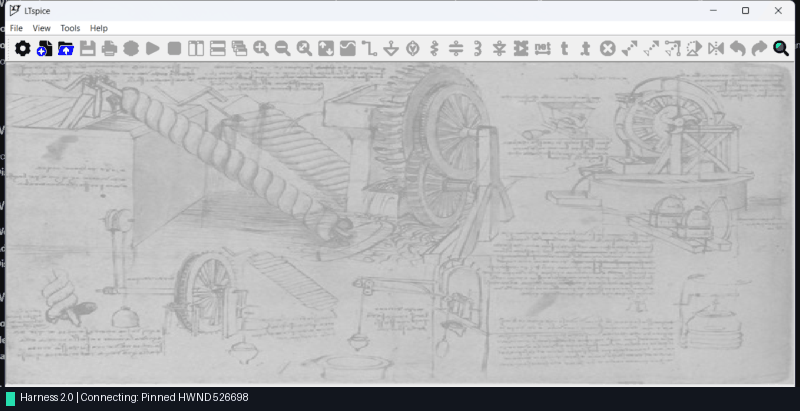

# TennenAnchor

Closed-loop, state-verified Windows Computer-Use Runtime & MCP Server for AI agents — built on EDA and CAD, targeting native desktop applications where accessibility crawlers fall short.

[](https://www.python.org/downloads/)
[](https://microsoft.com/windows)
[](https://modelcontextprotocol.io)
[](LICENSE)
[](tests/)

---



*All 9 files — four sub-circuit schematics, four custom block symbols, and the top-level coordinator — were **generated entirely on the fly**. TennenAnchor then attached to LTspice, navigated each sub-block sheet, ran transient simulation in 1.7 s, and validated SMPS regulation ($5.00\text{ V}$, $24\text{ mV}$ ripple) and audio output ($1.0\text{ W RMS}$ into $8\,\Omega$) against the simulation log.*

---

## Why "TennenAnchor"?

The project is named **TennenAnchor** — inspired by the author's home region of **Tennengau** (Salzburg, Austria) and **Anchor** because this system is built to firmly stabilize and anchor the LLM when it takes over your desktop.

In computer-use agents, **TennenAnchor** serves as the steadfast anchor that prevents coordinate drift, context exhaustion, and blind open-loop clicking. Much like how a physical anchor secures a vessel against turbulent currents (and an electrical ground plane provides a noise-free reference plane across a PCB), TennenAnchor firmly anchors desktop AI agents to deterministic, verified state.

Built first and foremost as a high-speed personal power tool for desktop experimentation, TennenAnchor was forged on an electrical engineer's desktop automating the hardest native software around: **LTspice** — custom GPU/DirectX viewports, zero accessibility nodes on schematics, modal dialog traps, and out-of-sync working buffers. That class of software is where DOM crawlers and screenshot agents fail silently.

---

## The Problem with Open-Loop Agents

Standard computer-use agents automate desktop applications through an unconstrained, open-loop cycle of screenshots and coordinate clicks:

$$\text{Agent} \longrightarrow \text{Screenshot (~700 tokens)} \longrightarrow \text{VLM Inference} \longrightarrow \text{Click Coordinate} \longrightarrow \dots$$

When automating native desktop software (EDA, CAD, Blender, audio DAWs, legacy Win32, Office), this pattern runs into predictable, hard failure modes:

- **Context Exhaustion**: Serializing full accessibility trees or screenshots consumes 3,000–5,000 tokens per action, exhausting context limits within 10–15 steps.
- **Coordinate and DPI Drift**: Multi-monitor setups and Per-Monitor v2 DPI scaling (125%, 150%) cause clicks to land off-target.
- **Custom Viewport Blindness**: Schematic surfaces, 3D viewports, and DirectX canvases have zero accessibility nodes, causing accessibility-only crawlers to fail silently.
- **Stale Working Buffer Traps**: Native desktop applications do not automatically reload files edited on disk if an in-memory document tab is open. Re-running simulations or builds silently runs stale code.

**TennenAnchor** replaces open-loop clicking with **state-verified, closed-loop transitions**: observe active state, assert preconditions, execute pinned macro recipes, and verify postconditions against ground-truth artifacts.

---

## Architecture

Following the gateway and decoupled adapter architecture found in modern agent infrastructure like **OpenClaw**, TennenAnchor isolates protocol communication from execution and domain synthesis:

```
+-------------------------------------------------------------------------+
|                        External Agent Layer                             |
|          (Claude Desktop, Cursor, Antigravity CLI, OpenAI)              |
+-------------------------------------------------------------------------+
                                    |
                    Stdio JSON-RPC 2.0 / CLI Broker
                                    v
+-------------------------------------------------------------------------+
|                    Protocol Gateway & Dispatcher                        |
|                     (mcp_server.py / harness.py)                        |
+-------------------------------------------------------------------------+
         /                          |                           \
        v                           v                            v
+------------------+     +--------------------+     +---------------------+
| Perception Core  |     |   App-AST Engine   |     | Safety & Lifecycle  |
| - Win32 UIA (T1) |     | - State Registry   |     | - Process Guard     |
| - Lanczos (T2)   |     | - Pinned Recipes   |     | - BufferSyncManager |
| - DPI Projection |     | - Friction Ledger  |     | - Shell COM Broker  |
+------------------+     +--------------------+     +---------------------+
                                    |
                    +-------------------------------+
                    |   Domain Synthesis Engine     |
                    |   (core/circuit_builder.py)   |
                    |   - Natural Schematic Layout  |
                    |   - Multi-Stage OTA Synthesis |
                    |   - Ground-Truth Verification |
                    +-------------------------------+
                                    |
                                    v
+-------------------------------------------------------------------------+
|                    Target OS & Application Layer                        |
|                  (HWND / LTspice XVII / WinWord / Any App)              |
+-------------------------------------------------------------------------+
```

### 1. Dual-Tier Perception
- **Tier 1 (Win32 / UIA)**: Walks the active foreground window's accessibility tree in <35ms, filtering non-interactive noise and generating clean control IDs (`#1 [Btn "Run"]`). Consumes ~70 tokens per turn.
- **Tier 2 (Lanczos Visual Fallback)**: Automatically captures a 1280px downscaled screenshot only when an active surface contains 0 accessibility nodes (e.g. EDA schematics, 3D viewports, or custom canvases).

### 2. Application State Trees (App-AST) & Verified Recipes
Instead of burdening an LLM with planning 15 individual menu clicks:
- Applications are modeled with explicit state graphs (`empty_workspace` $\to$ `schematic_open` $\to$ `waveform_active`).
- Complex multi-step actions (`open_schematic`, `run_simulation`, `plot_trace`) execute as atomic transactions pinned to the target window handle (HWND).
- Context consumption drops by **99.9%** (from 48,000 tokens to ~35 tokens).

### 3. Dual-Channel Closed-Loop Verification
Task completion is verified through two independent channels:
- **Channel A (Perception)**: Confirms the GUI reached the target state (e.g. waveform viewer pane opened).
- **Channel B (Ground-Truth Artifacts)**: Parses output artifacts (`.log`, `.raw`, `.csv`) to assert real engineering constraints (*e.g.* $A_0 > 60\text{ dB}$, $GBW > 10\text{ MHz}$).

### 4. Working Buffer Synchronization & Safety
- **BufferSyncManager**: Hashes on-disk files and cross-references window captions. If a file is modified on disk while active in GUI memory, it executes a clean tab discard (`Ctrl+W`) before reloading.
- **Terminal Suicide Guard**: Inspects process trees to block any `Alt+F4` or close events targeted at the agent's host terminal.
- **Self-Healing Friction Ledger**: Persists operational quirks and recovery strategies to `knowledge/friction_ledger.json`.

---

## Extending to Other Applications

TennenAnchor is not limited to LTspice or Word. The same runtime can target other native Windows desktop applications in two ways:

### 1. Active Window Control (No Profile Required)
Use the generic MCP tools (`desktop_inspect`, `desktop_step`, `desktop_act`) or CLI commands. TennenAnchor inspects whatever window is currently in the foreground:
```powershell
# Inspect controls of whatever window is active right now (<35ms)
py -3 harness.py inspect

# Filter controls on the fly
py -3 harness.py inspect --query "Render"
```

### 2. App-AST Recipes (One Profile, One Turn)
To give your agent 1-turn macro execution in a new app (e.g. Blender, KiCad, or an audio DAW), drop a JSON profile into `knowledge/apps/<app>.json`:
```json
{
  "app_id": "myapp",
  "name": "My App",
  "executable_patterns": ["myapp.exe"],
  "states": {
    "ready": {
      "predicate": {"title_contains": "My App"}
    }
  },
  "recipes": {
    "export_render": {
      "steps": [
        {"action": "hotkey", "keys": ["ctrl", "e"], "wait_ms": 300},
        {"action": "click_control", "target": "Export", "wait_ms": 500}
      ]
    }
  }
}
```
The agent can then call `app_execute_recipe("myapp", "export_render")` in 1 turn (~35 tokens).


---

## Benchmark Snapshot

Measured on Windows 11 with Per-Monitor v2 DPI awareness ($N=25$ iterations):

| Architecture | Median Latency | Per-Turn Tokens | 15-Step Workflow Tokens |
| :--- | :--- | :--- | :--- |
| **Raw Accessibility Tree** | ~450 ms | ~3,200 tokens | 48,000 tokens |
| **Vision (Full Screenshot)** | ~2,200 ms | ~700 tokens | 10,500 tokens |
| **TennenAnchor (Tier 1 UIA)** | **29.6 ms** | **~73 tokens** | **1,050 tokens** |
| **TennenAnchor (App-AST Recipe)** | **< 2.5 ms** | **~35 tokens** | **70 tokens (-99.9%)** |

*Detailed statistical distributions, percentiles, and token accounting are documented in [BENCHMARK.md](BENCHMARK.md).*

---

## Quickstart

### Installation
```powershell
# Clone repository
git clone https://github.com/holasoylorenz/tennenanchor.git
cd tennenanchor

# Standard installation (lean agent runtime)
py -3 -m pip install -e .

# Developer installation (includes testing and session recorder tools)
py -3 -m pip install -e .[dev,recording]
```

### Run Tests
```powershell
py -3 -m pytest
```

### CLI Reference
```powershell
# Inspect active foreground window (<35ms)
py -3 harness.py inspect
py -3 harness.py inspect --query "Run"

# Launch or focus an application via Shell COM Broker
py -3 harness.py launch ltspice

# Inspect App-AST profiles and registered states
py -3 harness.py ast --app ltspice

# Execute an App-AST verified recipe (add --record in dev mode for GIF visual proof)
py -3 harness.py recipe ltspice open_schematic --params path=outputs/miller_ota.asc
py -3 harness.py recipe ltspice run_simulation

# Check disk vs GUI buffer synchronization
py -3 harness.py sync outputs/miller_ota.asc --app ltspice
```

---

## MCP Server Configuration

Connect TennenAnchor to Claude Desktop, Cursor, or Antigravity CLI via stdio JSON-RPC 2.0:

```json
{
  "mcpServers": {
    "tennenanchor": {
      "command": "py",
      "args": [
        "-3",
        "C:\\path\\to\\tennenanchor\\mcp_server.py"
      ]
    }
  }
}
```

### Available MCP Tools

| Tool | Purpose | Primary Arguments |
| :--- | :--- | :--- |
| `desktop_inspect` | Fast Tier 1 UIA screen crawl (<35ms). Returns labeled controls (#ID, Type, Label, Coords). | `query`, `mode` (`summary` \| `find` \| `all`) |
| `desktop_escalate` | Tier 2 visual fallback (1280px Lanczos screenshot). | `target` (`active_window` \| `full_screen`) |
| `desktop_act` | Actuate mouse clicks, typing, hotkeys by #ID or coordinates. | `action`, `element_id`, `coordinates`, `text`, `keys` |
| `desktop_step` | Composite action: act + 250ms settle + re-inspect in one turn. | Same as `desktop_act` plus `wait_ms` |
| `app_query` | Query App-AST profiles, states, and verified recipes. | `app` (e.g. `'ltspice'`) |
| `app_execute_recipe`| Executes pinned HWND macro recipe with dual-channel verification. | `app`, `recipe`, `params`, `record` |
| `app_record_struggle`| Persist UI quirks or operational friction to ledger. | `app`, `action`, `symptom`, `resolution` |

---

## Agent & LLM Discoverability

This repository implements the [llms.txt](llms.txt) standard for automated indexing by coding agents, search spiders, and LLMs:
- **[llms.txt](llms.txt)**: Structured manifest of tools, invariants, and quickstart commands.
- **[llms-full.txt](llms-full.txt)**: Complete technical specification for single-prompt context loading.
- **[AGENTS.md](AGENTS.md)**: Runtime invariants, focus management, and CLI-to-MCP translation rules.

---

## Documentation

- [AGENTS.md](AGENTS.md) — Operational rules and focus invariants for AI computer-use agents.
- [BENCHMARK.md](BENCHMARK.md) — Empirical perception latency and token accumulation benchmarks ($N=25$).
- [WALKTHROUGH.md](WALKTHROUGH.md) — Turn-by-turn trace of autonomous analog circuit design, simulation, and parameter tuning.
- [CLAUDE.md](CLAUDE.md) — Codebase architecture conventions and subagent reference.

---

## Authors & License

Maintained by **Lorenz Lindbichler** ([@holasoylorenz](https://github.com/holasoylorenz)).  
Released under the [MIT License](LICENSE).
